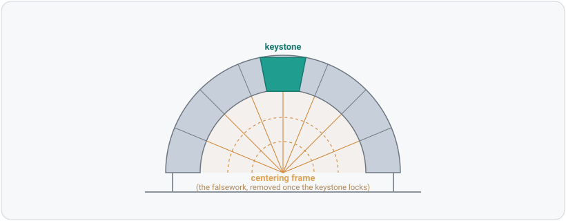
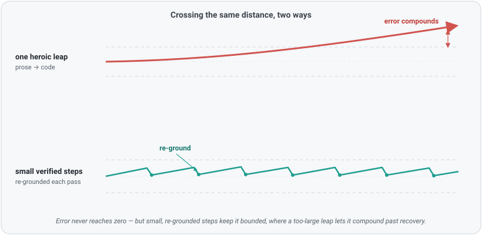
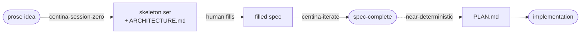

# Centina

> Most building traditions have a word for the temporary frame that holds an
> arch in shape while it's under construction, until its keystone locks and
> the frame can be struck: the frame that teaches the arch its shape until it
> can stand alone. German calls it *Lehrgerüst* — literally "teaching frame."
> French calls it *cintre*; Spanish, *cimbra*. This project takes its name
> from the Italian term, *centina* — the word that named the frames behind
> Brunelleschi's dome and the rest of the Renaissance's structural
> ambition, an engineering discipline in its own right rather than incidental
> carpentry.

<p align="center">
  <picture>
    <source media="(prefers-color-scheme: dark)" srcset="docs/assets/falsework-dark.svg">
    
  </picture>
</p>

**Centina** is spec-flavored TypeScript: a medium for writing structured, rule-checked pseudocode, i.e., *falsework*, for a coding task before it is built. TypeScript supplies the grammar and the expressiveness; a spec-plane checker, not the TypeScript compiler, is the arbiter of "done." A Centina spec is built first and checked for structure, so it teaches the implementation its shape, and it is up front about being scaffolding rather than product.

The rest of this document is the argument for why a medium like this is becoming necessary, and how Centina answers it.

## Contents

- [Centina](#centina)
  - [Contents](#contents)
  - [Why this exists](#why-this-exists)
    - [The error floor](#the-error-floor)
    - [The practical failure: over-competence](#the-practical-failure-over-competence)
  - [Centina's answer](#centinas-answer)
    - [The responsibility split: meaning is the human's, implementation is the agent's](#the-responsibility-split-meaning-is-the-humans-implementation-is-the-agents)
    - [TypeScript as pseudocode, checked for meaning, but not compiled](#typescript-as-pseudocode-checked-for-meaning-but-not-compiled)
    - [The spec as a first-class artifact, and PLAN.md as its near-deterministic output](#the-spec-as-a-first-class-artifact-and-planmd-as-its-near-deterministic-output)
    - [The restraints on the agent](#the-restraints-on-the-agent)
  - [Caveats](#caveats)
    - [Who should use it](#who-should-use-it)
    - [When to use it (and when not to)](#when-to-use-it-and-when-not-to)
    - [What Centina most definitely isn't for](#what-centina-most-definitely-isnt-for)
  - [Getting started](#getting-started)
    - [Claude Code setup](#claude-code-setup)
    - [Using Centina without Claude Code](#using-centina-without-claude-code)
  - [What to do first](#what-to-do-first)
  - [Documentation](#documentation)
    - [The core mechanism: the typed hole with routing](#the-core-mechanism-the-typed-hole-with-routing)
    - [The vocabulary, primitive by primitive](#the-vocabulary-primitive-by-primitive)
      - [Domain content — describing the system](#domain-content--describing-the-system)
      - [Authoring markers: metadata for the checker and the agent](#authoring-markers-metadata-for-the-checker-and-the-agent)
  - [How to actually use it](#how-to-actually-use-it)
    - [Gap-hunting sessions](#gap-hunting-sessions)
    - [A walkthrough: one seam, prose to spec-complete](#a-walkthrough-one-seam-prose-to-spec-complete)
  - [The goals (the invariant everything else serves)](#the-goals-the-invariant-everything-else-serves)
  - [What this offers over planning-mode conversation](#what-this-offers-over-planning-mode-conversation)
  - [Developing Centina itself](#developing-centina-itself)
  - [State of the project](#state-of-the-project)
  - [Commands](#commands)
  - [Repository layout](#repository-layout)

---

## Why this exists

### The error floor

Start with what an AI model *is*. A coding agent is a pattern-recognizer trained on enormous quantities of noisy, chaotic data. That training is what makes it powerful, and it is also what makes it, formally, a **chaotic system**, one whose outputs are exquisitely sensitive to conditions we can neither fully specify nor fully observe. Chaotic systems have a property that
no amount of engineering removes: a **floor on how much error you can eliminate**. However sophisticated the model becomes, some irreducible error remains in its outputs in the aggregate.

Two consequences follow, and they compound each other:

1. **As outputs grow more sophisticated, their errors grow harder to
   detect.** A crude mistake announces itself. A subtle one, a plausible
   assumption, a quietly-wrong edge case, an interface that is *almost*
   right, hides inside work that otherwise reads as correct. The better the
   model, the more its errors look like competence.

2. **Undetected marginal errors compound invisibly** until they cross a
   visibility threshold, at which point the failure is finally obvious, but
   its *origin* is not. By then it may be genuinely intractable to trace where
   the error started, and any attempt to correct it manually or with an agent
   risks introducing still more error. You are debugging accumulated drift,
   not a bug.

How to live with this is an open question, but other disciplines that grapple with chaotic systems offer a cue. Consider the **n-body problem** in astrophysics: how bodies move under their mutual gravitation. For three or more bodies there is no general analytical solution. The problem is worked **numerically**, which means it is solved again and again over short intervals of time, re-grounding the trajectory at every step so that error never has room to grow large before it is corrected. There is no closed form that gets you to the answer in one leap; there is only the discipline of taking small, verified steps.

<p align="center">
  <picture>
    <source media="(prefers-color-scheme: dark)" srcset="docs/assets/error-floor-dark.svg">
    
  </picture>
</p>

The wager of Centina is that the new human–agent coding paradigm needs some form of the same discipline: **frequent, structured re-grounding of intent against a checkable artifact, before error has room to compound** — not one heroic prompt that leaps from idea to implementation.

### The practical failure: over-competence

That abstract problem has a very concrete daily face in agentic coding, and it is not incompetence. It is **over**competence.

Hand a capable model a problem and it will go and solve it, often by making assumptions, filling gaps, and generating structure you did not expect, intend, or want. Models have gotten better at asking questions, and planning modes have grown more capable, but there is a ceiling on what conversational prose can carry. Past a certain complexity, prose is simply not a precise enough medium to *design* a solution in. It smooths over exactly the seams where intent and implementation diverge, and it lets the agent quietly introduce **latent technical entropy**, decisions that look settled but were never actually made by a human that will not surface as a problem until much later, when it is far more expensive to address.

**A single sentence can demonstrate the problem**. Picture a planning conversation settling on *"the dashboard shows the user's most recent order."* It reads like a decision, but it is three undecided ones in a trench coat: what happens when the user has **no** orders (the empty case), whether *"recent"* sorts by when the order was created or when it was last touched, and whether a draft or cancelled order counts as an order at all, a question about the *shape* of the thing. Even if the agent asks for clarification, conversational prose, even interspersed with structured outputs, obfuscates meaning and intent, which will end up accumulating the longer the session and the more complex the design becomes. The agent wants to be helpful, so it will let you sail past critical questions over meaning and intent, answering them silently and plausibly the moment it drafts an implementation plan or writes code; none was ever the human's call, and each is far, far cheaper to uncover during early design than to reverse-engineer from later failures.

The insidious part is that a fluent agent's confabulated architecture looks *identical* to an elicited one. A clean, plausible, well-shaped design disguises which parts were the human's conviction and which were the agent's guess. The human then ratifies a coherent picture, half of which they never decided, and the entropy is baked in before a line of real code exists.

This is the compounding-error problem arriving one prompt at a time. It demands an approach that harnesses what the model is genuinely good at without handing it the one thing it should not hold: authority over *meaning*.

---

## Centina's answer

### The responsibility split: meaning is the human's, implementation is the agent's

Centina draws a hard line through the planning work:

- **Meaning and intent belong to the human.** *What* the data *is*, the shapes
  it takes, the directions it flows, which decisions are made and which are
  deliberately deferred. This is the human software architect's thinking, and
  it is precisely the part that cannot be delegated without reintroducing the
  entropy above.
- **Implementation belongs to the coding agent.** *How* the pinned intent is
  carried out (the algorithms, the code, aka the *realization*) is where the agent's strength lives
  and where it should be pointed.

The whole medium exists to keep those two separated *continuously*, so that by the time an agent is implementing, there is nothing left for it to invent.

### TypeScript as pseudocode, checked for meaning, but not compiled

A Centina spec is a **valid TypeScript file** (suffix `.centina.ts`) that imports a small vocabulary module (`centina.ts`). There is no new grammar, so every editor on earth already parses, highlights, and completes a spec with no extension installed.

But the point is not to compile it, and not to produce executable code. TypeScript is used here as a **rigorous pseudocode**, a way to state structure (names, shapes, arities, directions, contracts) precisely enough that a machine can check it, while reading like organized prose rather than a program to run. Read a `.centina.ts` file as *authorial intent expressed in typed declarations*, not as code with literal runtime semantics.

> [!CAUTION]
> **A Centina spec is not executable code — do not run it, ship it, or treat it
> as an implementation.** It is a formal *semantic descriptor* for a piece of
> software's design and architecture: an **"intent-as-code" artifact** whose
> whole purpose is to state design intent precisely, with hidden ambiguity
> minimized and every known unknown surfaced as a marked, routed hole. The
> TypeScript grammar is a checkable notation for that intent, nothing more; the
> function bodies, casts, and control flow are pseudocode illustrating *shape
> and intent*, not runtime behavior to be executed.

Two checkers cooperate:

- **`tsc`, run under a deliberately permissive config** (`tsconfig.json`),
  kept for what it is genuinely good at — name resolution, arity, shape — and
  relieved of the duties that fight a spec-writer (unused locals, missing
  implementations; `declare` is legal and encouraged). A clean `tsc` run is
  the necessary floor, not the ceiling.
- **The Centina spec-plane checker** (`checker/`, `npm run check`), which
  layers the rules that are actually Centina's: enumerating typed holes and
  their routing, enforcing boundary direction, assumption-bookkeeping on `as`
  casts, naming-consistency on the free-text namespaces no compiler validates,
  and a "does this spec say what it is for" explanation check. The same rules
  surface live in the editor through a TypeScript language-service plugin, so
  spec diagnostics appear alongside `tsc`'s as you type.

> [!IMPORTANT]
> A spec is not "done" when it compiles. It is done when **every gap in it is
> deliberate, typed, and routed** — deferred to the human, delegated to an
> agent, referenced from external code, or quarantined behind a boundary.

### The spec as a first-class artifact, and PLAN.md as its near-deterministic output

A Centina spec is a durable software artifact in its own right, not a throwaway prompt. Once a spec is clean, the implementation plan (`PLAN.md`) should follow from it *nearly deterministically*; two agents handed the same frozen spec should produce substantially the same plan, because the meaning has already been pinned and only the carrying-out is left, which itself is well-defined, tightly-controlled, and clearly marked.

It is useful to think of a Centina spec as **"code" for a coding-agent "runtime."** The spec is the program; the agent is the interpreter; PLAN.md and the eventual implementation are its output. And like the n-body integrator above, this puts a **re-grounding checkpoint** between intent and implementation: a structured place where accumulated ambiguity is forced to
the surface and corrected *before* it compounds into code. Every iteration on the spec is one short, verified step.

### The restraints on the agent

For that checkpoint to work, the agent has to be kept off the parts that are the human's. Centina's toolchain enforces this through explicit rules of engagement:

- **The agent never decides meaning** (Rule 0). Data nouns, shapes,
  directions, and the resolution of deferred holes are the human's to author.
  The agent supplies *form* — skeletons, syntax, holes, and elicits the rest
  with questions.
- **The agent helps generate the skeleton, not the content.** It may lay down
  typed seams and marked holes that trace to something the human ratified;
  anything the human did *not* decide comes out as a routed hole, never a
  plausible fill. An over-complete skeleton is the bug, not the feature.
- **The agent does not hold the pen on an existing spec** (Rule 0a). During a
  refinement session it surfaces decisions and lets the human write them; if
  asked to edit anyway, it pushes back once (naming the risk that the human may
  be offloading thinking meant to stay theirs), then complies if they persist.

> [!IMPORTANT]
> The agent is a **scribe, not an architect.** Supplying *form* — skeletons,
> syntax, holes — is its job; authoring *meaning* is never delegated. That
> separation is the mechanism that keeps over-competence from getting a
> foothold.

## Caveats

### Who should use it

Anyone can use Centina, but it's not intended for everyone. The value you can expect to get out of Centina is directly proportional to the amount of software design and engineering expertise you bring.

> [!WARNING]
> Inexperienced software developers may find using Centina to be a frustrating
> experience. It will ask you to think carefully about details that may seem abstract,
> tedious, and pedantic. It will push back on choices that don't seem consistent with
> earlier decisions. It will refuse to do your thinking for you.

**Note:** The fact that Centina emits spec artifacts in Typescript does **not** imply it can be used only for Typescript or Javascript projects, or even only for web-based applications. The choice of using Typescript as the spec-language is simply due to its incredibly robust type system (practically a separate language in its own right), and its expressiveness (its widespread popularity is also a huge bonus). A capable agent should have no trouble understanding that the **target** language is not the same as the **spec** language, and that the two are related in terms of intent, not execution.

To summarize: Centina specs can be used for any target language, and that choice would be specified at implementation time, not in the spec itself or during planning phases (as mentioned elsewhere, Centina deliberately avoids specifying the technologies used for implementation).

### When to use it (and when not to)

Centina isn't a good fit for every problem, but is ideal for many. Here's a quick rundown.

Best fit:

- new projects of moderate-to-high complexity
- new features of moderate-to-high complexity in existing projects
- new features of moderate-to-high complexity in under-development projects

Likely fit:

- full rewrites of major components in existing projects
- ground-up rewrites of existing projects
- refactors of large or complex, highly-decoupled components in existing projects

Unlikely fit:

- small or simple projects with low complexity and/or few unknowns, or that tread well-established ground
- small or simple maintenance tasks in existing projects
- refactors of large or complex but highly-coupled components in existing projects
- projects or solutions with a high level of implementation (lots of computation) and a low level of structure (little in the way of business rules or interactivity)

> [!TIP]
> If you're not sure if your problem is a good fit for Centina, simply start your agent 
> session from within this project and ask. The project is loaded with plenty of context
> for your agent to help you make an assessment.


### What Centina most definitely isn't for

Centina can't, or at least shouldn't:

- help you decide which technologies to use in your project
- help you implement a complex algorithm
- help you write software you don't understand or can't specify
- tell you what good software architecture actually looks like, or how to develop it

> [!CAUTION]
> Centina cannot replace your brain or your experience. (That's what 
> standard agent planning sessions are for 😉) 
> 
> Centina is extra leverage for the experience and competence 
> you *already possess* as a software engineer, with all that implies.

## Getting started

### Claude Code setup

Centina ships as a self-contained Claude Code plugin. There is nothing to install globally and no server to run — Claude Code installs the checker's own dependencies for you the first time it needs them. To stand up your first spec:

1. **Clone the Centina repo, anywhere, and install it.** The clone is a
   one-time source for the install — not something you keep around or
   reference afterward.

   ```console
   git clone https://github.com/adamtwede/centina.git
   cd centina && ./install.sh
   ```

   This copies the plugin (vocabulary, checker, skills, docs — see
   [docs/plugin-file-layout.md](docs/plugin-file-layout.md) for exactly
   what) into `~/.claude/skills/centina/`, which Claude Code auto-loads
   every session with no flag needed. **You can delete the clone after
   this step.** Nothing in the installed copy references the clone's
   location — Claude Code loads the plugin from the install location
   itself, and the one thing a project depends on afterward for live
   in-editor checking (the compiled checker) lives in Claude Code's own
   persistent per-plugin data directory, keyed by the plugin's name, not
   by any checkout's path. Keep the clone around only if you plan to pull
   updates and re-run `install.sh` later — it's a frozen snapshot, not a
   tracked link.

   `bin/centina-check` (the checker's CLI) ends up at
   `~/.claude/skills/centina/bin/centina-check`, but installing doesn't put
   it on your `PATH`. That's fine for normal use — Claude Code skills
   invoke it directly via `${CLAUDE_PLUGIN_ROOT}`, nothing to configure
   there — but if you ever want to run it yourself from a terminal, either
   add that `bin/` directory to your `PATH` or call it by full path
   (`install.sh` prints the exact path to use at the end of the install).

   Prefer a one-off session against a specific checkout instead (no
   install, no lasting change)? `claude --plugin-dir /path/to/centina`
   loads it for that session only. See
   [Plugin distribution and install mechanics](docs/plugin-distribution.md)
   for this and the marketplace options, once you want to share Centina
   with someone else or across machines.

2. **Start Claude Code from the project you want to spec.**

   ```console
   cd your-project
   claude
   ```

3. **Invoke the `centina-session-zero` skill.** It's auto-discovered from
   the plugin (`/centina-session-zero`, or it may surface on its own from a
   description of what you want to build). First invocation in a new tree
   runs the setup procedure — [docs/plugin-setup-procedure.md](docs/plugin-setup-procedure.md)
   — which asks where the host project root and Centina's own files
   (`artifactsRoot`, defaulting to `./centina/`) should live, then walks you
   through each gated phase: eliciting the shape, routing every undecided
   question into a visible hole, and emitting a skeleton spec set plus an
   `ARCHITECTURE.md` at the end.

   Not using Claude Code? See
   [Using Centina without Claude Code](#using-centina-without-claude-code)
   below — the skills are plain markdown any capable agent can follow, but
   the setup steps this section automates need to happen by hand instead.

**What you end up with.** Session zero hands off a skeleton spec set plus `ARCHITECTURE.md`; running `centina-iterate` on each component then walks it to clean and, once it's clean, derives that component's `PLAN.md` from it, reconciling `ARCHITECTURE.md`'s contract and hole ledgers against the now-finished component immediately beforehand, so the ledger never claims more
than what's actually settled. Repeat `centina-iterate` per component until the seams you intend to implement now all have plans (see [Which specs earn a plan](docs/plan-organization.md): Not every component needs one immediately; a mocked boundary is a legitimate, practical, and even
advisable stopping point, allowing you to shepherd complex projects through meaningful, isolated phases).

The end state is a self-contained package: one or more `PLAN.md` files (pegged to boundary-sets, not necessarily one per file — see [docs/plan-organization.md](docs/plan-organization.md)) plus a reconciled `ARCHITECTURE.md` recording the DAG, the frozen contracts, and what's still deferred. That package is designed to travel. Hand it to any coding agent, in this repo or an entirely different codebase, and it has everything it needs to implement against, with no in-session context required.

For what actually happens in that session (and in `centina-iterate`, the follow-on that refines a single spec toward complete) see [How to actually use it](#how-to-actually-use-it).

### Using Centina without Claude Code

Everything above assumes Claude Code, which is what makes setup turnkey — the plugin loader, the `SessionStart` hook that installs the checker's own dependencies, and `${CLAUDE_PLUGIN_ROOT}`/`${CLAUDE_PLUGIN_DATA}` resolving as environment variables are all Claude Code mechanisms. None of that is required to use Centina, though: the checker is a plain TypeScript CLI, and the skills are plain markdown any capable agent can follow. This section is what those mechanisms are standing in for, done by hand — verified against a real run with no Claude Code environment variables set at all.

For OpenCode-based setups, or for harnesses constrained with sandbox configurations that prevent arbitrary path read/writes, follow the instructions given in the included [opencode-install](docs/opencode-install.md) doc (or point your agent to them).

**Otherwise:**

The [docs/plugin-setup-step.md](docs/plugin-setup-step.md)'s "Harness portability" section is the fuller design-level treatment, if you're building something more automated than what's below.

> [!TIP]
> You can either follow these instructions manually, or you can direct your
> coding agent to them and let it figure it out. No guarantees it'll work,
> but it's straightforward enough that most should be able to handle it. 
> Just start a session in this folder and tell your agent to set up Centina 
> for use in other projects.

1. **Get the plugin content on disk** — same `install.sh` as
   [Getting started (Claude Code)](#getting-started-claude-code) step 1. It
   has no Claude Code dependency itself, it's a plain copy script.

   ```console
   git clone https://github.com/adamtwede/centina.git
   cd centina && ./install.sh ~/wherever/you/want/it
   ```

2. **Install the checker's own dependencies once, by hand.** There's no
   `SessionStart` hook to do this for you outside Claude Code:

   ```console
   cd ~/wherever/you/want/it/checker
   npm install
   ```

3. **Set up your own project by hand** — this is what
   [docs/plugin-setup-procedure.md](docs/plugin-setup-procedure.md)'s Steps
   3–4 do automatically inside a Claude Code session:
   - Copy `centina.ts` and `docs/boundaries.md`, `docs/fit-validation.md`,
     `docs/plan-organization.md` from the install directory into your
     project (wherever you want `specs/` to live).
   - Write a `tsconfig.json` there based on
     [tsconfig.template.json](tsconfig.template.json). Omit
     `compilerOptions.plugins` entirely if you only need the CLI check
     below — that field is read by an editor's TypeScript language service
     (tsserver), never by the CLI. If you *do* want live in-editor
     diagnostics and your editor uses tsserver (VS Code, and most others),
     set it to the absolute path of `<install directory>/checker/tsPlugin.cjs`
     instead — that works the same regardless of what loaded the plugin,
     Claude Code or not.

4. **Run the checker directly** — not `bin/centina-check`, which expects
   `CLAUDE_PLUGIN_DATA` to be set and refuses to run without it.
   `checker/cli.ts` itself has no Claude Code dependency:

   ```console
   cd ~/wherever/you/want/it/checker
   npx tsx cli.ts --project /path/to/your/project/tsconfig.json /path/to/a/spec.centina.ts
   ```

5. **For the workflow itself** — the gated elicitation process, Rule 0, the
   rest of what `centina-session-zero`/`centina-iterate` actually do — hand
   your agent `skills/centina-session-zero/SKILL.md` or
   `skills/centina-iterate/SKILL.md` from the install directory and ask it
   to follow them. Every `${CLAUDE_PLUGIN_ROOT}` reference inside is a
   stand-in for the install directory's absolute path — resolve those
   yourself before handing the file over, since no such variable exists
   outside a Claude Code session.

## What to do first

Centina's mental model is far easier understood and its value is far more easily demonstrated by actually using it. Once it is installed, start up a coding agent session and invoke the `centina-session-zero` skill.

Going through a session will be significantly more instructive than reading through the rest of this documentation. Once you have a firsthand sense of how it works, feel free to come back to gain a deeper understanding of how to best leverage the toolset.

For more details on this, follow the [How to actually use it](#how-to-actually-use-it) section.

## Documentation

### The core mechanism: the typed hole with routing

Centina's central primitive is the **"typed hole,"** a known gap in the design with a route for resolution. A spec is finished not when it has no gaps, but when every gap is *deliberate, typed, and routed*, i.e., deferred to the designer writing the spec, delegated to an agent, referenced from external code, or quarantined behind a boundary. 

Aside: It's worth being aware that "finished" is a relative term. Software design is (potentially) infinitely recursive, and Centina's goal is to help guide you to the balance point between reinventing the wheel (and the laws of physics themselves), and where you can safely stop iterating on your design (at least for now) without coming to regret it later.

The typed holes, enumerated:

| Hole | Spelling | Routing |
|---|---|---|
| deferred decision | `const f = deferred<(a: A) => B>()` | routing itself undecided — the checker flags it (a decision still owed) |
| → routed to this/another spec | `deferred<"spec", F>()` | belongs in a separate `.centina.ts`, part of a larger workflow |
| → left to the implementer | `deferred<"open", F>()` | the planning agent's discretion; not a gap the human must close |
| → held for a human-authored body | `deferred<"unimplemented", F>()` | a real body is owed before planning; a hard stop until filled |
| agent-directed note | `// @agent: ...` / `// @agent(C1): ...` | the coding agent resolves it at spec-iteration or plan-build time; optional label gives it a stable name to reference |
| external | `/** @external "src" */ declare ...` | lives in existing code / an API / an external system |
| boundary | `/** @datasource\|@datasink\|@boundary */ declare class ...` | a declared, black-box data seam; doors are the privileged entry/exit points |

The signature behind a hole is real and participates fully in type checking. Callers are held to it even though nothing exists behind it yet. That is what lets a *consumer* be specified against a seam that has not been built, and built in parallel with it.

Two operating principles that form the foundation:

- **Boundaries model affordances, not transports** — a boundary is a set of
  *doors* (what you can "do" with respect to an interface or boundary), 
  and direction is inferred from each door's return type (`void` = write, 
  non-`void` = read), never from its name.
  See [docs/boundaries.md](docs/boundaries.md).
- **Provenance is bookkeeping, not prohibition.** Every value's origin should
  be *visible* — names must resolve, and every `as` cast is a recorded
  assumption, but the spec-writer is free to assemble records and sketch
  structure without fighting a privilege system.

### The vocabulary, primitive by primitive

The typed hole is the centerpiece, but a spec is written in a handful of other primitives too. They fall on the two sides of the responsibility split: some are **domain content** (they describe the real system the spec is about), and some are **authoring markers** (metadata addressed to the checker and the coding agent, never part of what the spec models). Each is ordinary TypeScript.

To view the whole vocabulary in code, see: [centina.ts](centina.ts).

#### Domain content — describing the system

**`Unshaped<Name>` — an opaque domain noun.** A named thing the spec talks about without committing to its shape. The brand makes it a pure named, or *nominal*, type: an `Unshaped<"Formula">` can never be confused with an `Unshaped<"Feedback">`, and no ordinary object accidentally satisfies either. A value of an `Unshaped` type can only enter the spec from a declared source (a door, an `@external`, an `Agent` cast) — and that entry point *is* its provenance record.

```ts
type Formula = Unshaped<"Formula">
// A Formula can't be conjured from a literal; it must arrive from a declared
// source — here, the agent below, where the `as` records the shape assumption.
```

**`Agent<Model>` — the model a spec converses with.** The one boundary Centina ships pre-built. `prompt`/`review` return `unknown`, so the author *records the shape assumption* with an `as` at each call. This is bookkeeping, accounting, not prohibition. The `Model` parameter carries the agent's identity with no cast: an `Agent<ModelId>` hands the same `ModelId` back from `.modelId`.

```ts
const supervisor = new Agent(ModelId.CLAUDE_OPUS)
const someFormula = agent.prompt("Generate a random formula.") as Formula
//                                                             ^ recorded assumption
```

> [!IMPORTANT]
> `Agent` (a value in the spec's pseudocode) is the *runtime* model the finished
> system will converse with — **never** the coding agent helping you write the
> spec. That second, spec-authoring channel is the `@agent:` comment below.
> Same word, unrelated concepts.

**`Skill<In, Out>` — a delegated capability with a declared contract.** A named, invocable capability the spec's `Agent` can call — distinct from a raw `prompt`. Its type parameters *are* its contract, declared once and enforced at every call site: pass the `Skill` as `invokeSkill`'s first argument and the remaining inputs are checked against `In` while the result is typed `Out`, with no cast. Unlike a raw `prompt` (whose `as` is recorded per call), a skill's shape assumption is recorded *once*, at the declaration — so two call sites can't silently disagree about its shape.

```ts
const explain: Skill<[Formula, FormulaType], string> = { name: "formula-explanation" }
//                  ^ input types            ^ output
const text = agent.invokeSkill(explain, someFormula, FormulaType.UNKNOWN) // : string
```

#### Authoring markers: metadata for the checker and the agent

**`deferred<…>()` — the typed hole.** The signature is real and type-checks its callers; the *routing* is what varies. Bare means routing is still owed (a warning); the three kinds resolve it (see the table above).

```ts
const score  = deferred<(step: Step, output: string) => Score>()   // routing owed → warning
const rank   = deferred<"spec", (c: Candidate[]) => Candidate>()   // its own spec, unwritten
const decide = deferred<"open", (node: Node) => Decision>()        // implementer's discretion
const lookup = deferred<"unimplemented", (n: Name) => Row>()       // hard stop until a body exists
```

**`@external "src"` — a reference into existing code.** A plain `declare` tagged with its source. The declaration site is where the assumption about the outside world is recorded; call sites then use the declared type with no cast.

```ts
/** @external "node:crypto" */
declare function randomUUID(): string
```

**Boundaries — `@datasource` / `@datasink` / `@boundary`.** A declared, black-box data seam, spelled as a JSDoc tag on a `declare class`. Direction is inferred from each door's return type — `void` = write, non-`void` = read — never from its name (`@datasource` = read-only, `@datasink` = write-only, `@boundary` = both). See [docs/boundaries.md](docs/boundaries.md).

```ts
/** @datasource The store of placed orders. */
export declare class OrderStore {
  readMostRecent(customer: string): RecentOrder // non-void ⇒ a read door
}
```

**`@agent:` / `@agent(label):` — a note to the coding agent.** The spec-authoring channel between you and whichever agent is running a session
with you, to be resolved at spec-iteration or plan-build time, never part of the spec's domain content. An optional label gives a note a stable name to reference later.

```ts
// @agent(C1): confirm whether a cancelled order needs its own banner before planning.
```

## How to actually use it

### Gap-hunting sessions

Two project skills drive Centina as a collaborative, gated process. Both are **gap-hunting** sessions: their job is to help a human architect pin down structure while making every unresolved decision *visible* as a routed hole rather than an invisible guess.

- **[centina-session-zero](https://github.com/adamtwede/centina/blob/main/skills/centina-session-zero/SKILL.md)** — the front of the funnel for a whole *system*.
  It drives a gated conversation that turns a prose idea into a **component
  DAG**: the high-level components, the typed contracts on the borders between
  them, and the terminal nodes where the system meets existing technology. Only
  then does it emit a **skeleton spec set** (typed seams + routed holes, no
  internal processing) and an [ARCHITECTURE.md](specs/wordboard/ARCHITECTURE.md) 
  recording the DAG, the contract ledger, and the hole ledger. 
  Each phase is gated: nothing advances until the
  human ratifies it, and anything left unratified becomes a marked hole. The
  guiding image is *diffusion inverted* — the agent raises the **resolution of
  the questions** it asks each pass; the human paints in the pixels.

- **[centina-iterate](https://github.com/adamtwede/centina/blob/main/skills/centina-iterate/SKILL.md)** — refines a *single* spec toward clean. It runs the
  checker, walks the human through each diagnostic, separates mechanical fixes
  from genuine design ambiguities the pseudocode left implicit, settles them
  *with* the human, and re-checks until the spec is clean and the human is
  satisfied — then derives `PLAN.md` from the frozen spec.

Crucially, "fit" is treated as a **jurisdiction map, not a verdict**. A realization-dominated responsibility (an algorithm, a physics loop, a rendering step) is never *rejected* from a spec — it is *routed behind a door* (a terminal, a delegated Skill, or a held `deferred<"unimplemented">` hole), and the spec keeps the typed seam around it. Even an idea that turns out to be "one algorithm, not a system" yields a minimal skeleton that is explicit about its remit rather than a bounced request. The value is in *localizing* the realization into a named, bounded hole.

Every node gets read on two planes, and where its center of gravity sits decides how it is routed:

| Plane | What it captures | Where it lands in a spec |
|---|---|---|
| **Structural** | relationships between named data: provenance, flow, contract ("*X* comes from *Y*, in shape *Z*") | a filled-in component |
| **Realization** | the carrying-out: algorithm, dynamics, aesthetics; no nameable data relationship | routed behind a door: a terminal, a Skill, or a held hole |

The lineage: **`ARCHITECTURE.md` + skeleton set** (session-zero) → each **`<component>.centina.ts`** filled in (iterate) → **`PLAN.md`** perboundary-set (the implementation).



> [!TIP]
> **A word on models and effort level:** Accurately gauging which model and thinking/effort 
> level to use in any agentic coding session is part experience and part trial-and-error. Centina 
> is no different in that respect, but strong directives in the skills and project docs should prevent 
> your agent from trying to tackle too much at once. Centina is designed from first principles to 
> guide you through recursively breaking your project up into manageable chunks, an approach 
> that aligns both human and AI model along the same axis. 
> 
> Start somewhere near the middle, and if your agent seems to be missing important details, 
> dial it up. Otherwise, leave it alone or dial it down and watch for any degradation in performance.

### A walkthrough: one seam, prose to spec-complete

To ground the two skills, follow a single seam of that same order dashboard, the one whose prose hid three decisions, through both stages. (Heavily condensed; a real session is many more exchanges.)

**The prose seed.** The human opens `centina-session-zero` with a sentence:

> "A signed-in customer sees a dashboard with their most recent order and its
> status."

**Session-zero elicits the shape, gate by gate** — it _draws structure out_ and presents the choices, something coding agents are really good at, aiding the human developer in weighing the tradeoffs against their stated priorities, _without_ allowing the agent to simply make the decisions and run with them:

- *Intent (phase 1):* restated back in the human's own terms, ratified.
- *Components (phase 2):* the human names two nodes: a **Dashboard**
  orchestrator and an **OrderStore** it reads from. (The agent resists naming
  the store first; the human draws it.)
- *Seam (phase 3):* the door from Dashboard into OrderStore: a read (non-`void`
  return). Then the highest-yield question, *what happens on the empty /
  not-found case?*, forces exactly the three decisions the prose smuggled past:
  **no orders** returns an explicit empty result, not null; *"recent"* sorts by
  **when the order was placed**; a **cancelled** order still counts, a **draft**
  does not. Each is ratified into the contract.
- *Terminal (phase 4):* OrderStore terminates at the existing orders database —
  an `@external` edge, concrete source TBD, *recorded, not fabricated*.

The ratified DAG — two components, one typed seam, one terminal:


**Session-zero emits the skeleton** — typed seam, routed holes, no bodies.
`shared.ts` carries the ratified vocabulary:

```ts
export enum OrderStatus { PLACED, SHIPPED, DELIVERED, CANCELLED }

// The order as the dashboard needs it. `placedAt` is the sort key (phase 3);
// there is no DRAFT — drafts are deliberately not orders here (phase 3).
export type Order = { id: string; status: OrderStatus; placedAt: number }

// The empty case is a first-class shape, not a null (phase 3).
export type RecentOrder = Order | "none"
```

and the boundary declarator states the door, its direction inferred from the
return type:

```ts
/** @datasource The store of placed orders, backed by existing order data. */
export declare class OrderStore {
  // Most recent by `placedAt`; "none" when the customer has no qualifying order.
  readMostRecent(customer: string): RecentOrder
}
```

The one thing the human has *not* settled, that is, whether a cancelled order surfaces with its own banner or folds into the normal view, ships as a hole, never a guess:

```ts
// In dashboard.centina.ts. Routing still undecided → the checker flags it.
export const presentOrder = deferred<(order: RecentOrder) => DashboardView>()
```

`npm run check` reports that hole and the `DashboardView` name it leans on but
nothing yet defines:

```console
$ npm run check -- specs/order-dashboard/dashboard.centina.ts
  [warning] hole-enumeration  :12 — deferred<...>() hole — routing still owed
  [error]   tsc               :12 — cannot find name 'DashboardView'
```

That is the handoff: **interfaces present and concrete, one decision held.**

**The human fills, then runs the centina-iterate skill.** Later the human resolves the held question: cancelled orders get their own view — and writes it in themselves (the agent holds no pen past the skeleton). They open `centina-iterate`, and the checker surfaces the residue one item at a time:

- `DashboardView` is referenced but undefined → the human adds its shape.
- the `deferred` hole's routing is still owed (a warning) → the human commits it
  to `deferred<"open", …>`, the implementer's discretion, since banner-vs-fold
  is a rendering call, not a contract.

Re-check: clean. The spec is **spec-complete** — every gap deliberate, typed, and routed. `PLAN.md` now follows near-deterministically, and the three decisions the prose would have buried are on the record, made by the person who should have made them.

> [!TIP]
> The mental model in two sentences: **you decide *what*; the agent, with your
> express approval at every critical juncture, decides *how*.** Nothing that
> matters is left to chance.

## The goals (the invariant everything else serves)

The four goals are the project's *only* invariant; every rule and primitive is a means under test against them. Note that each is **comparative**. The baseline is conversational prose. Centina produces structured, rule-checked pseudocode that:

1. makes it easier for a human to describe and understand a complex coding
   task, at a given level of detail, to themselves and other humans, than
   conversational prose;
2. makes it more likely that unknowns, ambiguities, and oversights are caught
   during spec-writing and review rather than surviving into implementation;
3. makes it more likely that a coding agent produces an implementation plan
   that accurately reflects the spec-writer's intention;
4. provides a foundation to iterate on, before and after planning and
   implementation.

*Bonus: a spec is a self-documenting record for future reference.*

## What this offers over planning-mode conversation

A good planning-mode conversation and a Centina spec both aim to align a human
and an agent before code is written. The difference is what each *leaves
behind* and where the authority sits:

| | Planning-mode conversation | Centina spec |
|---|---|---|
| **What it leaves behind** | a transcript in a scrollback — it evaporates | a durable, versioned, mechanically checked artifact a fresh agent picks up cold |
| **The meaning/impl line** | the agent can smuggle a decision into fluent prose, unnoticed | anything the human didn't decide is a *visible hole* the checker won't pass as resolved |
| **Deferral** | "we'll figure it out later" is a dropped thread | a typed hole with an explicit route, tracked in a ledger until it's closed |
| **Re-grounding** | a matter of remembering to be careful | structural — the n-body discipline, correct-before-compounding, built in |

For an experienced developer this is leverage, not overhead: it is a way to
**keep a powerful coding model appropriately restrained while still harnessing
its strengths**, and thereby to raise the ceiling on the software they can
reliably produce with it.

---

## Developing Centina itself

Working on Centina's own vocabulary, checker, or skills is the one case where you *do* run the plugin against the repo it lives in. From the Centina checkout's own root:

```console
claude --plugin-dir .
```

Prefer `--plugin-dir .` over your `~/.claude/skills/centina/` install for this: that install is a frozen `install.sh` snapshot, so it won't reflect edits you're making in the checkout at all, and re-running `install.sh` to pick them up would also make every *other* session on the machine load in-progress or possibly-broken changes — fine for a stable daily-driver install, not for iterating on Centina itself.

This is also the path for verifying a packaging change actually works end-to-end, as opposed to the harness-level checks `npm run check` and `npm run typecheck` already cover. A first session in a freshly cloned or freshly reset checkout is a real test of the whole plugin lifecycle at once — the `SessionStart` hook, skill auto-discovery, and the [setup procedure](docs/plugin-setup-procedure.md)'s first-run path all fire for the first time. Worth checking for, in order:

1. **The `SessionStart` hook ran.** No visible output on success (that's by
   design — see [docs/plugin-checker-install.md](docs/plugin-checker-install.md));
   a failure should surface a clear message, never a silent no-op. You can
   confirm it directly: `${CLAUDE_PLUGIN_DATA}/checker/node_modules` should
   exist after the session starts.
2. **The skills are discoverable.** `/centina-session-zero` and
   `/centina-iterate` should both appear.
3. **Invoking one triggers first-run setup.** Since this repo already has
   its own `specs/`, `centina.ts`, and `tsconfig.json` at its root, the
   setup step's host-root and artifacts-root prompts are exercised for
   real — watch for whether it correctly treats the repo root as a
   sensible default rather than getting confused by the pre-existing
   layout.
4. **The checker actually runs.** `bin/centina-check` (invoked by the
   skill, or directly: `${CLAUDE_PLUGIN_ROOT}/bin/centina-check --project
   <resolved tsconfig path> <a spec file>`) should produce the same
   findings `npm run check` does natively against the same file.
5. **The generated `tsconfig.json`'s plugin path points at `DATA`, not
   `ROOT`.** Open `<artifactsRoot>/tsconfig.json` and check
   `compilerOptions.plugins[0].name` — it should resolve inside
   `${CLAUDE_PLUGIN_DATA}` (e.g. `.../plugins/data/centina-inline/checker/tsPlugin.cjs`),
   never inside the checkout. This is what makes an already-set-up project
   survive the checkout being moved or deleted (see the DATA-vs-ROOT
   discussion in `docs/plugin-setup-step.md`'s Step 4) — a regression here
   would silently reintroduce that fragility without any test above
   catching it, since 1–4 all still pass either way.

`install.sh` is separate from the session-lifecycle checks above — it's a plain shell script, not something a Claude Code session exercises on its own. After changing it, run it against a scratch destination (`./install.sh /tmp/centina-install-test`) and diff the result against
`docs/plugin-file-layout.md`'s directory tree by hand; there's no automated check for it.

Anything that doesn't match — a silent hook failure, a skill that doesn't surface, a setup prompt that behaves unexpectedly against this repo's own layout, a stale `ROOT` path back in the generated tsconfig — is exactly the kind of gap `npm run check`/`npm run typecheck` can't catch, since neither exercises the plugin machinery at all.

## State of the project

What exists:

- **`centina.ts`** — the vocabulary module: opaque domain nouns
  (`Unshaped<"...">`), `deferred` (the typed hole with routing), `Skill<In,
  Out>` (a delegated agent capability with a declared contract), and `Agent`
  (the one boundary Centina ships pre-built — the model a spec converses with).
- **The checker harness** (`checker/`, `npm run check`) — merges `tsc`'s
  structural diagnostics with its spec-plane rules (hole enumeration, boundary
  direction, boundary dependency-direction, assumption bookkeeping, naming
  consistency, spec-explanation), surfaced live in-editor via a TypeScript
  language-service plugin, with a TextMate injection grammar tinting the
  Centina markers.
- **Worked specs** —
  `specs/hill-climbing-loop/` (the founding fixture, `npm run typecheck` clean), plus `specs/wordboard/` and
  `specs/grid-inventory/`, two systems stood up through `centina-session-zero`
  (skeleton set + `ARCHITECTURE.md` each).
- **`tsconfig.json`** — the deliberately permissive spec-plane config;
  **`.prettierrc`** — the formatting convention (`semi: false`) for
  `.centina.ts` files.

`ROADMAP.md` tracks build order and open questions (chief among them the
prose-vs-Centina head-to-head that tests goal 3 directly).

## Commands

- `npm run typecheck` — `tsc` over the vocabulary and all `*.centina.ts`
  specs (the structural floor).
- `npm run check` — the full Centina checker: `tsc`'s diagnostics plus the
  spec-plane rules. `npm run check -- <file...>` scopes to given specs and
  their transitive local imports.

## Repository layout

- `centina.ts` — the spec vocabulary (`Unshaped`, `deferred`, `Skill`,
  `Agent`).
- `checker/` — the spec-plane checker harness, rules, and the TS
  language-service plugin.
- `editors/vscode/` — the (unpublished) TextMate injection grammar.
- `docs/boundaries.md` — boundary design: affordances-not-transports, the
  three roles, direction-from-returns, drawing guidelines.
- `docs/fit-validation.md` — the running design memo: goals, the
  falsifiability frame, and the findings log that drove the pivot.
- `skills/` — `centina-session-zero` and `centina-iterate`, the current
  toolchain, packaged for plugin auto-discovery.
- `.claude-plugin/`, `hooks/`, `bin/`, `scripts/`, `tsconfig.template.json`
  — the plugin manifest, `SessionStart` install hook, and the
  `centina-check` wrapper; see [docs/plugin-file-layout.md](docs/plugin-file-layout.md).
- `specs/` — per-feature specs, each in its own dash-named folder.
