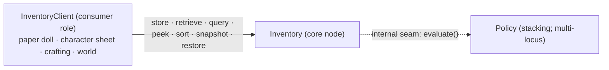

# ARCHITECTURE — grid-inventory

**Produced by:** `centina-session-zero`, live interactive run, 2026-07-21.
**Skeleton:** `shared.ts` (vocabulary), `grid-inventory.centina.ts` (the core
node). Each component below is ready for `centina-iterate`.

Grid-based inventory for a modular, swappable game-systems ecosystem. Configurable
as single-cell (Minecraft: one item per slot) or multi-cell (Diablo: an item spans
a rectangular footprint). The overriding design goal — **full isolatability**: no
outbound references, so partners can be swapped with shallow mocks — is realized
here as a DAG with **zero terminal nodes**.

## 1. Component DAG

- **Inventory** — the one core node. Owns the grid state; exposes the common
  client door-set. Fully isolatable (no outbound edges).
- **Policy** — an **internal seam** of Inventory, not a separate node. One
  `evaluate` door; definitions authored per-ItemType and per-Inventory.
- **InventoryClient** — a single generic **consumer role**, not a component the
  system contains. Every partner (paper doll, character sheet, crafting, world)
  instantiates it by depending only on the frozen `Inventory` interface. It has
  no door Inventory calls, so it is deliberately **not** a boundary declarator —
  drawing one would manufacture a seam that doesn't exist.

The top-priority fork (**one configurable system vs. two separate systems**) was
**decided in-session**: a single unified contract, with the implementation count
(one branching impl vs. two impls) deferred to fill. See §6.

## 2. Contract ledger (frozen — do not relitigate)

All doors live on the `Inventory` interface. Coordinate-addressed throughout;
reads resolve to the placement *covering* a coord, writes place rooted at it.

| Door | Signature | Direction | Status |
| --- | --- | --- | --- |
| store-in-any | `storeInAny(items: Stack): StoreResult` | write-w/-receipt | decided |
| store-in-specific | `storeInSpecific(root: Coord, items: Stack): StoreResult` | write-w/-receipt | decided |
| retrieve-by-cell | `retrieveByCell(coord: Coord): Stack` | mutating read | decided |
| query-by-type | `queryByType(type: ItemType): CellView[]` | read | decided |
| peek | `peek(coord: Coord): PeekResult` | read | decided |
| peek-all | `peekAll(): CellView[]` (row-major, occupied-by-root) | read | decided |
| read-metadata | `readMetadata(): InventoryMetadata` | read | decided |
| sort | `sort(criteria: SortCriteria): void` | mutating repack | decided |
| snapshot | `snapshot(): Snapshot` | read | decided |
| restore | `restore(snapshot: Snapshot): void` | write | decided |
| policy seam | `Policy.evaluate(operation, affected, context?): PolicyDecision` | read (internal) | decided |

Vocabulary decided (in `shared.ts`): `ItemType` (definitional: id, maxStackSize,
footprint, weight, tags, stackingPolicy) vs `ItemInstance` (per-copy: optional
client-minted `id`, its type, held stack-busting properties); `Stack` (homogeneous
by type, bounded by maxStackSize); `CellView` (`{ rootCoord, footprint,
contents }`); the `StoreResult` / `PeekResult` result families; `SortCriteria`
(built-in `SortOrder` **or** a `StackComparator`); `InventoryMetadata`.

Standing principle: **"Inventory is mechanism, not negotiator"** — it answers
yes/no to the payload as presented, never infers client intent, furnishes info +
tools; clients own contingency/negotiation.

**Intent-as-spec encoding (auto-emitted at phase 5):** the ratified invariant
"sort's client comparator never receives an empty cell's contents" is carried by
the type `NonEmptyStack = [ItemInstance, ...ItemInstance[]]` on `StackComparator`,
not by a prose note — a checked guarantee in both directions.

## 3. Hole ledger

| Hole | Where | Routing |
| --- | --- | --- |
| Stacking-policy shape | `StackingPolicy` (shared.ts) | held; opaque brand, per-ItemType |
| Instance stack-busting property set | `InstanceProperties` | held; filled at iterate |
| Policy op / role / id / error-code vocabularies | `PolicyOperation` etc. | held; opaque brands |
| Policy `context` bag | `PolicyContext` | PARKED |
| Policy scope broadening (capacity-as-policy, …) | Policy seam | open |
| Empty-input (`[]`) store convention | store doors | open, minor |
| store-in-any multi-cell receipt grouping | `StoreResult` | open convention |
| retrieve out-of-bounds behavior | `retrieveByCell` | open convention |
| Built-in `SortOrder` set | `SortOrder` (shared.ts) | held; enum starter, non-exhaustive |
| Snapshot schema | `Snapshot` | held; opaque, round-trippable, owned by Inventory |
| **Fit / packing algorithm** | `fitPlacement` (`deferred<"unimplemented">`) | held realization — the dominant hole; shared by store-in-any & sort's repack; multi-cell footprints + parked orientation live here |
| Placement-regime implementation count | `fitPlacement` interior | deferred to fill (one branching impl vs. two) |
| Query homogeneity (`Stack` type) | shared.ts | untypeable — `@agent:` note, not a type |

## 4. Terminal nodes

**None.** This is the notable structural result: the isolatability goal is met by
construction. Persistence is snapshot/restore doors (the client owns storage and
holds the opaque `Snapshot`), and instance identity is client-minted upstream, so
Inventory has **no `@external` edges and no outbound terminals**.

## 5. Risks / watch-items

- **The whole system is essentially one node + one internal seam.** This is honest
  and expected here — the value was freezing the door-set contract, not
  discovering a multi-node DAG. Not a defect; noted so a later reader doesn't hunt
  for missing components.
- **`fitPlacement` is the center of gravity by topology** — the single held
  realization hole under the entire write/sort surface. Gravity (whether it's the
  *important* work) is the human's call; topologically it's where all the
  realization concentrated. This is the natural first `centina-iterate` target.
- **query-by-tag is a likely-future door** (crafting matches on tags). Not added
  now, per operations-on-demand; flagged as the spot the common door-set grows.
- **Concurrency is layerable without contract change:** single-op atomicity via an
  internal per-op lock (invisible); multi-op atomicity relies on the design's
  drift-tolerance (retrieve returns current contents) or an additive reservation
  door later. Nothing frozen here forecloses multi-threading.
- **Under-test convention:** `NonEmptyStack` as an intent-as-spec type encoding
  (see §2) — the triggering case for the "encode ratified intent into the type
  system" directive promoted to both skills this session.

## 6. Rejected alternatives

- **Two separate inventory systems (single-cell and multi-cell).** The human
  initially reasoned toward this (contract uniformity has long lifetime value;
  storage flexibility is only early-value). **Reframed and set aside** via
  contract-vs-implementation separability: partners depend on the door-set
  *contract*, which unifies cleanly; the single-vs-multi difference lives *below*
  the seam as held implementation. So the contract is frozen once and the
  implementation count is deferred to fill — no adapters, swap problem dissolved.
- **retrieve-by-type door.** Dropped in favor of a non-mutating `queryByType` the
  client turns into a retrieve — avoids a second mutating path and keeps retrieve
  cell-addressed.
- **A generalized query-by-field door.** Rejected as "too messy"; specific
  on-demand query doors (by type, later by tag) preferred.
- **Inventory-minted instance UUIDs.** Rejected: minting on store would add an
  id-generation dependency and risk a fresh id each round-trip. Identity is
  client-minted at item creation; Inventory only offers the carried field.
- **Multi-cell addressing via shadow sub-cells with root pointers.** Rejected in
  favor of placement-as-the-addressable-unit (covering-placement, root-derivable),
  which keeps uniform grid addressing and exposes no pointer-chasing in the
  contract.
- **Persistence as an outbound terminal.** Rejected in favor of snapshot/restore
  doors, keeping Inventory isolatable (no store dependency).
