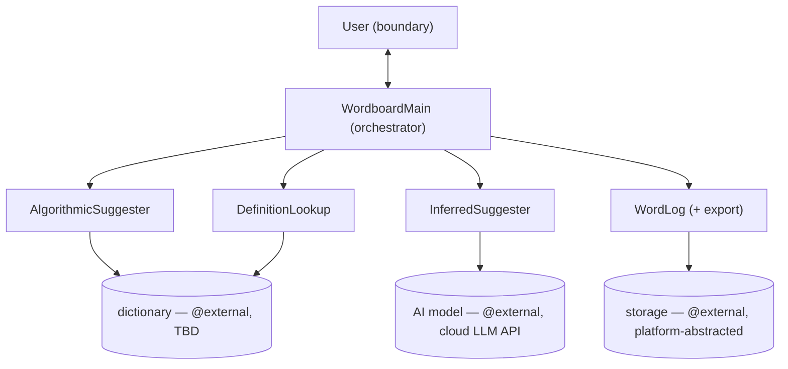

# Wordboard — Architecture

A word tracker for a writer: capture words you want to use (algorithmically, or
by describing what you mean and inferring), keep them in a log with concise
definitions, and export the log. Produced by a `centina-session-zero` run; this
file is the system-level companion to the per-component spec skeletons in this
folder. Every contract below was ratified during that session — the skeleton is
transcription of those decisions plus routed holes, not authored architecture.

## 1. Component DAG

A **star**: every seam runs WordboardMain ↔ a boundary; there are no
inter-component edges (the components are mutually ignorant, each independently
mockable). WordboardMain's far side is the **User**, modeled as a boundary.

| Node | Responsibility (one line) |
|---|---|
| **WordboardMain** | Thin orchestrator; coordinates the five boundaries. Holds no domain logic. |
| **AlgorithmicSuggester** | Mode-1: deterministic (Levenshtein-over-dictionary) suggestions for a spelling attempt. |
| **InferredSuggester** | Mode-2: AI-inferred suggestions for a context (+ optional attempt). |
| **DefinitionLookup** | Resolves a definition for a selected word (pulled only at selection). |
| **WordLog** | The word log plus its (folded-in) export; storage-backed. |
| **User** | The human on WordboardMain's far side, as an intent-level boundary. |

## 2. Contract ledger

Direction: `@datasource` = all reads; `@boundary` = mixed (direction per door,
from return type). `@boundary` doors use the under-test `read*/write*/exchange*`
naming convention. All contracts below are **decided** unless noted.

**AlgorithmicSuggester** `@datasource` (→ dictionary)
- `suggest(word: string): Suggestion[]` — empty array = no matches (ratified).

**InferredSuggester** `@datasource` (→ AI model)
- `infer(context: string, attempt?: string): Suggestion[]` — context required, attempt optional; empty array = model returned nothing.

**DefinitionLookup** `@datasource` (→ dictionary)
- `lookup(word: string): Definition` — called only for an already-selected dictionary word (not-found case unelicited → hole).

**WordLog** `@boundary` (→ storage; folds export)
- `writeLogToStorage(entry: LogEntry): void` — write; caller verifies via read-back.
- `readLog(): LogEntry[]` — read; completed-only filtering is a held detail.
- `readByWord(word: string): LogEntry` — read; word-keyed (word-as-id).
- `export(format: ExportFormat): string` — parametrized read; kept plain (not `exchange*`) by decision.

**User** `@boundary` (WordboardMain's far side)
- `readWord(): string` — Mode-1 spelling attempt.
- `readContext(): { context: string; wordAttempt?: string }` — Mode-2 inputs; attempt optional.
- `exchangeSuggestion(suggestions: Suggestion[]): Suggestion | null` — pick, or null to dismiss.
- `exchangeConfirmation(word: string, definition: Definition): boolean` — confirm a resolved candidate.
- `readInferenceOutcome(): InferenceOutcome` — empty-inference choice.
- `readWordAttempt(): string` — forced committed attempt on save-incomplete.
- `exchangeExportFormat(formats: ExportFormat[]): ExportFormat` — pick a format.
- `writeLogToUser(formattedLog: string): void` — deliver the export.

**Vocabulary** (`shared.ts`, all decided): `InitiationMode = "algorithmic" | "inferred"`;
`Suggestion = { word }`; `Definition = string`; `ExportFormat { TEXT, MARKDOWN, CANONICAL }`;
`InferenceOutcome { RETRY, SAVE_AS_INCOMPLETE, DISCARD }`; `LogEntry = CompleteEntry | IncompleteEntry`
(discriminated on `status`).

## 3. Hole ledger

| Hole | Routing |
|---|---|
| WordboardMain capture/export flows | `deferred<"unimplemented">` — fill by human (centina-iterate). |
| WordLog completed-only filtering | Held detail behind the `readLog` door (fill). |
| Curation / "audit" step (Auditor) | Deferred component — not yet a node. |
| Upload | Deferred feature. |
| Update/edit an entry + completion-collision resolution | Deferred; likely its own component. An impl may withhold the incomplete-save affordance until designed. |
| AI↔dictionary alignment / non-dictionary-word flagging | Deferred: future `Suggestion` flag + an InferredSuggester→dictionary seam. |
| Durable `LogEntry` identity beyond `word` | Deferred. Word-as-id is "good enough for write-confirmation"; completing an incomplete entry *changes* its id (attempted spelling → resolved word). Revisit when edit/Auditor lands. |
| `DefinitionLookup.lookup` / `WordLog.readByWord` not-found cases | Unelicited; holes if the present-word assumption breaks. |
| Dropped-but-re-addable | Suggestion enrichment (matchKind/relevantContext); original-input retention. |

## 4. Terminal nodes (`@external`)

Concrete `@external` declarations are made *at fill*, where the held logic that
calls them is written — not reached through the doors in the skeleton.

| Terminal | Behind | Status |
|---|---|---|
| **dictionary** | AlgorithmicSuggester, DefinitionLookup | Source TBD; one or two sources open (wordlist for matching, possibly a separate definitions source). |
| **AI model** | InferredSuggester | Cloud-native LLM API by default; provider and the rest TBD. |
| **storage** | WordLog | Platform-abstracting persistence API (Capacitor-family / equivalent); concrete API TBD. NOT a raw file — the browser-runtime target can't write one. |

Runtime context (informs, not decided): a browser-runtime cross-platform app
(Capacitor/Ionic family the tightest fit for "web app runnable in a desktop
browser during dev, shippable to Android/iOS/desktop"; React Native/Expo and
Tauri as alternatives). Framework choice is the author's realization call.

## 5. Risks / watch-items

- **Thin-UI risk.** WordboardMain must stay a *coordinator*. Logic that belongs
  to a component must not accrete in the orchestrator. Watch across fill.
- **`read*/write*/exchange*` convention is first-use.** Scoped to `@boundary`
  doors (where the class tag doesn't imply direction). Its first real judgment
  call is `WordLog.export` (kept plain, not `exchange*`). If `exchange` keeps
  causing friction, the convention may be dropped or replaced with a more
  neutral term.
- **Word-as-id is provisional identity.** Fine for write-confirmation now;
  reopens if a durable identity is needed (edit / Auditor promotion). See hole
  ledger.
- **Boundary-as-user is experimental.** The `User` boundary is a first attempt
  at modeling the human as an intent-level boundary; whether it earns its keep
  guiding the eventual UI is the thing to evaluate.

## 6. Rejected alternatives

- **Export as its own node** → folded into WordLog for immediate simplicity.
  Promotion trigger: a second export consumer, Upload landing, or formats
  proliferating.
- **Two physical stores (complete vs incomplete entries)** → single log with a
  `status` discriminant.
- **Definition attached to `Suggestion`** → dropped; definitions are pulled only
  at selection (this also resolved the attempt-alone ambiguity and kept the
  suggesters decoupled from the definition source).
- **Separate `id` field on `LogEntry`** → word-as-id for now (see hole ledger).
